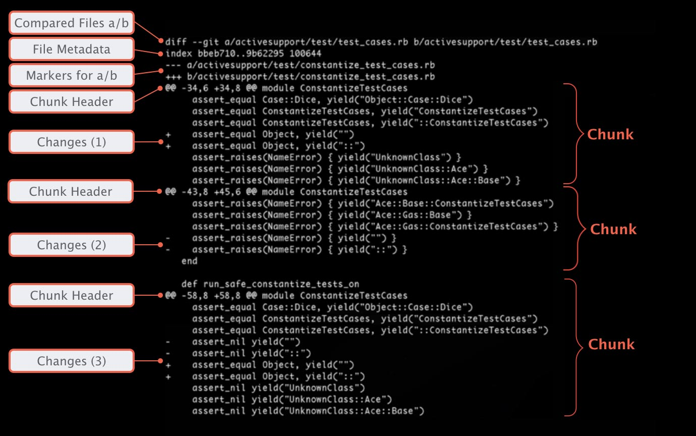

##### Branch oluşturmak

```
# branchleri listeler
git branch
master*
diger_brach

# master üzrinde çalışştığımıza göre aşağıdaki komut masterdan yeni branch oluşturur

git checkout -b new_branch
switch to a new branch new_branch

# tekrar master a geçmek için
git checkout master

```


#### Branch isim değiştirme ve silme

isim değiştirmek

```
git branch - <old name> <new name>
```
branch silmek

```
git branch -d <branch name>
```
eğer merge edilmemiş commitlerimiz varsa ozman silerken hata alırız. silmeyi zorlamak istiyorsak -d opsiyonunu -D olacak şekilde kullanmalıyız.

#### Interactive Staging

https://git-scm.com/book/en/v2/Git-Tools-Interactive-Staging

#### Comparing and Merging

- https://git-scm.com/book/en/v2/Git-Tools-Advanced-Merging

merge işlemi yaparken örneğin master branchine bir başka branch i merge etmek istiyorsak burada master target branch diğer branch ise kaynak branch olarak adlandırılır.

diğer branch master a merge edildiğind sadece master değişir diğerinde değişiklik olmaz.

bu işlemi yapmak için öcelikle target branch olan master branch e geçiş yapmak gerekir.

```
git checkout master

git merge <source branch>

```

karşılaştırma yapmak için 

```
git diff <branch1> <branch2>
```

**rebase**

rebase işlemi merge den farklı olarak diğer branchdeki bütün commitleri tek tek master branche ekler. tabi bu durumu artı ve eksileri vardır. en büyük artısı geriye dönük bütün adımlar görünür. ancak negatif kısmı ise diğer branch bir bütün olarak görünmez sanki master branch üzerinde yapılmış sıralı işlemler olarak görünür. ayrıca bu tarz bir işlemi remote e push edersek conflicklerin oluşmasına ve karmaşık bir commit düzeni oluşmasına sebep olabilir.


rebase yapmak için

```
git rebase master diger_brach

örneğin

	 o---o---o---B
	/
---o---1---o---o---o---A

yeni şekli alttaki gibidir

	 o---o---o---B
	/
---o---1---o---o---o---A---o---o---o---B
```
ancak bu şekilde yapamk yukarıda bahsi geçen problemlere sebep olabilir bu nedenler rebase interactive kullanılarak squash operasyonu ile diğer branch üzerindeki tüm commitler aynı merge de olduğu gibi tek bir branch olarak aktarılabilir.

rebase yapmadan önce rebasse yapılacak en iyi root commiti bulmaktır. bunun _merge-base_ koutu kullanılır.

```
git merge-base diger_branch master
buraya_commit_id_gelir

örneğin altta en iyi yer 1 nolu committir

	 o---o---o---B
	/
---o---1---o---o---o---A

```

daha sonra master üzerinde iken interactive rebase yapılır.

```
git rebase -i COMMIT_ID
```

açılan ekranda alınacak commitlerin baına squash yazılır ve rebase çalıştırılarak tek bir mesaj yazılır ve rebase-continue denilerek merge işlemi yapılmış olur.

**cherry pick**


başka bir brachein bütün commitlerini değilde tek bir commit i almak demektir.

-x parametersi ile yeni commite hangi commit nereden alındı gibi bir mesaj bırakır.

-e ise commit yaparken mesajı editleme imkanı verir

```
# feature branchin 2. commiti
git cherry-pick feature~2

# doğrudan commit id si vererek

git cherry-pick COMMIT_ID

# master ın 4. ve 2. commitleri üzerinde olduğumuz branch a commit edilir.

git cherry-pick master~4 master~2
```


#### Local and Remote Branches with team

manuel olarak remote eklemek istiyorsak

```
git remote add BRANCH_NAME REMOTE_URL
```

remote listesi almak için a

```
git remote -v 

```

### Diff

bu kısmı daha iyi anlmak için linux notlarındaki diff komutunu okuyunuz. 


- git diff : stage e atılmamış değişmeleri gösterir 
- git diff --cached (git commit): stage e gönderilmiş değişmeleri gösterir (commite hazır bekleyen)
- git diff HEAD (git commit -a) : son committen sonra neler değişmiş


bunlar aslında neyi commit edeceğimizi gösterir. check etmek için kullanışlı komutlar.


- git diff commit_id : current ile belli bir komut arasındaki farkları gösterir.
- git diff --cached commit_id : stage ile belli bir commit arasındakşi farklar
- git diff commit_id commit_id : iki commit arasınfaki farklar (commit_id yerine HEAD de yazılabilir)

üstteki komutlar ise bazı itemler araındaki farkları görmek için faydalıdır.

alttakiler ise branch ler arasındaki farklar için kullanılır.
- git diff branch diger_branch
- git diff feature...master: feature branch i başladığından beri master da neler değişdi
- git diff feature master file.txt: file.txt dosyası için iki branch arasındaki farklar neler


bir dosyanın iki branch de karşılaştırılmasına baktığımızda lattaki gibi bir örnekle karşılaşırız. 


Orijinal dosyanın (a.txt) aralığının önünde bir eksi simgesi bulunur ve yeni dosyanın (b.txt) aralığının önünde bir artı simgesi bulunur. Her hunk aralığı l, s biçimindedir, burada l başlangıç ​satırı numarasıdır ve s, her bir ilgili dosya için değişiklik hunk'ın uyguladığı satır sayısıdır. GNU diff'in birçok sürümünde, her aralık virgül ve sondaki s değerlerini çıkarabilir, bu durumda s varsayılan olarak 1'dir. Gerçekten ilginç olan tek değerin ilk aralığın l satır numarası olduğuna dikkat edin; diğer tüm değerler farktan hesaplanabilir.


master ve merhaba branch lerindeki master1.txt dosyası karşılaştılıyor.

```
git diff master merhaba master1.txt

# sonuç
diff --git a/master1.txt b/master1.txt

index 61ec6d3..7b6c6b0 100644

--- a/master1.txt
+++ b/master1.txt

@@ -1 +1,2 @@

-master commit 1
\ No newline at end of file
+master commit 1
+merhaba dan mastera mesaj
\ No newline at end of file

```
---, a, 61ec6d3 master branch ini işaret eder.
+++, b, 7b6c6b0 merhaba branch ini ifade eder.

100644 ise dosya modunun standart text olduğunu gösterir


buradaki commit id lerile aşağıdaki komutu çalıştırıp dosya içeriklerini görebiliriz. dosyların blob id leridir.

```
- git show 61ec6d3

master commit 1

- git show 7b6c6b0

master commit 1
merhaba dan mastera mesaj
```


görüldüğü üzere ilk satırlar aynı. ikinci satır ise merhaba branch inde farklı.

"diff --git a/master1.txt b/master1.txt" satırı ise linux deki diff komutunda --git versiyonun çalıştırıldığını gösterir


@@ -1 +1,2 @@ , b satırdaki @@ işaretleri chunk header olarak adlandırılır. bir diff birden fazla chunk a sahip olabilir ve herbirinin kendine ait header  ı vardır.


**burada dosya diyoruz ancak aslında aynı dosynın iki halini karşılaştırıyoruz önce si ve sonrası.aslında mantık çok basit: -1 +1,2 demek soldaki dosyadan 1. satırı kaldır yerine sağdaki dosyadan 1. ve 2. satıları koy. git diff eğer değiştirileccek yada etikilecek yada kopyalancak tek satır varsa -1,1 diye yazmaz sadece -1 veya +1 şeklinde yazar. yani ilk dosyayı ikinci dosya hline getirmek için yapılacak adımlar. burada aynı olan satırlar zaten bulunmaz**


burada örneğin -1 +1,2

-1 rakamı a branch inde 1 satır olduğunu ve 1. satırdan başladığını söyler. yani a branch indeki master1.txt dosyasında 1 satır ve o satırda master branch i içindeki master1.txt dosyaında.

+1,2 ise b branchinde yani merhaba branch inde 2 satır var ve merhaba branch indeki master1.txt dosyasının 1. satırından başlıyor. yani a branch ind

burada -,+ sadece negatif pozitif anlamına gelmiyor. - işareti ilk versiyondaki farklı satırları ve + sonraki versiyondaki farklı satırları gösterir. başında - veya + olamyanlar ise iki versiyonda da var demektir. 

bideki dosyada yok ancak eğer metinlerin yanında - veya + işsareti bulunmazsa bu satıraların 2 branch te de olduğu anlamına gelir.

iki branch karşılarştırılarken dev/null satıarlaı görülürse bu ilgili dosyanın diğer branch de olamdığını yani farkın dosya olmaamsı anlamına geldiğini ifade eder.


**örneğin alttaki ilk chunk/hunk da -34,6 +34,8 soldaki dosyadan 34. satırdan itibaren 6 satırın yerine sağdaki dosyanın 34. satırından itibaren 8 satırı kopyala demektir. burada dosya diyoruz ancak aslında aynı dosynın iki halini karşılaştırıyoruz önce si ve sonrası. birde burada şuna dikket etmek gerekiyor bahsi geçen ilk versiyondaki 6 satır ile ikinc iversiyondaki 8 satırın tamamı birbirinden farklı demek değil bazı satılar aynı olabilir ki zaten bu örnektede 2 satır farklı görünüyor changes 1 kutusuna bakılırsa görülebilir.**




**diğer bir örnek daha inceleyecek olursak, -1,11 demek işaretsiz satılar ile - işsaretli satırların toplamının 11 olduğu ve 1. satırdan itibaren başladığı anlamına gelir. 1,6 ise sonraki versiyonda yani merhaba branch indeki master1.txt deki 1 satırdan itibaren işaretsiz veya + işaretli satırlar demektir.**

```
git diff master merhaba master1.txt
diff --git a/master1.txt b/master1.txt
index 760230e..89751d6 100644
--- a/master1.txt
+++ b/master1.txt
@@ -1,11 +1,6 @@
 master commit 1
-master conflict
-merhaba conflict
-master conflict
-merhaba conflict
-master conflict 
 merhaba dan mastera mesaj
-master conflict
 merhaba conflict
-master conflict
 merhaba conflict
+merhaba conflict
+merhaba conflict
\ No newline at end of file

```
**resources**
- https://veriteknik.gitbook.io/linux-yonetimi/gelismis-terminal-komutlari/patch-ve-diff
- https://en.wikipedia.org/wiki/Diff#Unified_format
- http://manpages.ubuntu.com/manpages/trusty/tr/man1/diff.1.html
- https://nenedirnasilyapilir.com/linux-terminalinde-iki-metin-dosyasini-karsilastirma/
- https://git-scm.com/docs/git-diff
- https://git-scm.com/docs/git-diff#_combined_diff_format
- https://www.atlassian.com/git/tutorials/saving-changes/git-diff


#### Conflicts


öncelikle conflict oluşturacak ikşi branch deki master1.txt dosylarını karşılaştıralım.


```
git diff master merhaba master1.txt
diff --git a/master1.txt b/master1.txt
index e3e74fd..89751d6 100644
--- a/master1.txt
+++ b/master1.txt
@@ -1,6 +1,6 @@
 master commit 1
-master conflict
-master conflict
-master conflict
-master conflict
-master conflict
\ No newline at end of file
+merhaba dan mastera mesaj
+merhaba conflict
+merhaba conflict
+merhaba conflict
+merhaba conflict
\ No newline at end of file

```

bide tree olarak durumu görelim 


görüleceği üzere iki branch de de ortak olan ilk satır dışında diğer satırların hepsi conflict oluşturuyor.

conflict oluşturacak 2 branch i merge etmeye çalışalım. 

```
git merge merhaba
Auto-merging master1.txt
CONFLICT (content): Merge conflict in master1.txt
Automatic merge failed; fix conflicts and then commit the result.

```

tam bu esnada master branch i üzerindeyken status a bakalım

```
git status

On branch master
You have unmerged paths.
  (fix conflicts and run "git commit")
  (use "git merge --abort" to abort the merge)

Changes to be committed:
        new file:   merhaba1.txt
        new file:   merhaba2.txt

Unmerged paths:
  (use "git add <file>..." to mark resolution)
        both modified:   master1.txt

```
Unmerged paths: bölümünde master1.txt üzerinde ki conflict düzeltmesini yaptıktan sonra stage(index) area alanına eklememizi ce commitlememizi istiyor.


tam bu  esnada tree ye tekrar bakalım


görüleceği üzere merge işlemi tam ortada kalmış durumda. yani biz conflict i çözüp commit yaptıktan sonra mege işlemi gerçekleşmiş olacak.

peki sistem şu anda bu bilgiyi ve geçiş işlemlerini nere tutuyor ve nasıl yönetiyor.

.git kalsörüne bakacak olursak MERGE_HEAD, MERGE_MODE; MERGE_MSG ve ORG_HEAD dosyalarını görebiliriz. bu doyalar ile merge işleminin geçişi sağlanmaktadır.


dosyayı herhangi vir editörede açtığımızda (biz nano kullanacağız) aşağıdaki gibi bir görüntüye karşılaşcağız.

diff komutuyla aldığımız görüntünün aynısı. ilk satır hariç diğerleri conflict oluşturmuş. şuan master üzerindeyiz ve HEAD masterdaki değişimi gösteriyor burada ok yönü sola doğru (<<<). merhaba branchi ise ayraçın (====) altındaki kısım. zaten en al satırda master agelecek değişimin burası olduğu yazıyor ve hangi branch den geldiği.

bu dosya üzerdendeki değişiklikleri yapıyoruz ve aylaçları da siliyoruz. diyelimki biz bütün değişmleri alıyoruz ancak sıarını değiştirerek. düznlenmiş dosya aşağıdadır.


```
master commit 1
<<<<<<< HEAD
master conflict
master conflict
master conflict
master conflict
master conflict
=======
merhaba dan mastera mesaj
merhaba conflict
merhaba conflict
merhaba conflict
merhaba conflict
>>>>>>> merhaba

```

fix edilmiş (değiştirilmiş) master1.txt dosyası.

```
master commit 1
master conflict
merhaba conflict
master conflict
merhaba conflict
master conflict 
merhaba dan mastera mesaj
master conflict
merhaba conflict
master conflict
merhaba conflict

```

daha sonra dosyayı commitlemek için add ve commit komutlarını çalıştırıyoruz.

tam bu esnada .git klasörüne baktığımızda MERGE ile başlayan dosyların kalktığını görebiliriz.


tekrar tree ye bakacak olursak merhaba branch i üzerindeki fd1432b id li commit ile master branch i üzerindeki c7f804a id li commit in yeni oluşturulan 6be6861 id li commit ile merge edildiğini görebiliriz. yani --no-ff ile merge edildiğini söyleyebiliriz. çünki conflict in çözümü için yeni bir master1.txt dosyasına ihtiyaç vardı bu da yeni commmit demektir. -ff bu durumda çalışmayacağı için sistem kendisi --no-ff itercih etmiş oldu.


**resources**

- https://www.youtube.com/watch?v=qErVX17vbzU&list=PL_Z0TaFYSF3IqQKPOmbigAOVMMlZ2yU4K
- 