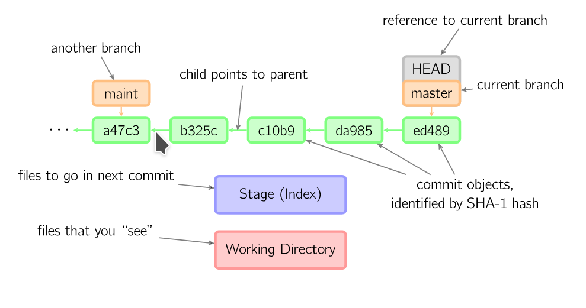
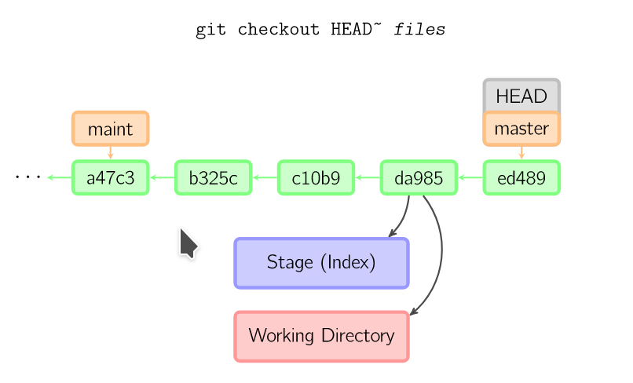
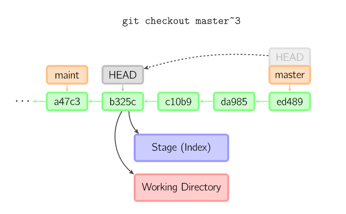
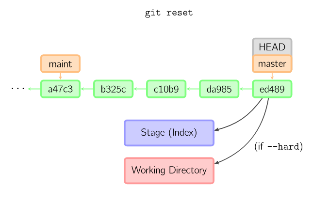

### Reset

reset komutu kullanma şekline göre değişiklik gösteren bir komuttur. bu nedenle çok karışıktır. ufak bir iki komutla working area, index (staging) ve repository alanlarını değiştirebilen bir komuttur. ayrıca hard reset yapılamsı durumunda ciddi riskleri olan bir komuttur.


temel olarak aslında reset komutu local repo daki commitin index ve working area'ya aktarılmasını ifade eder.

değişiklik yapımış olan bir dosyayı index (staging) area'ya aklemek için _git add_ komutunu çalıştırıyoruz. stage areadaki bir kodu local repository ye taşımak için ise _git commit_ commit komutunu kullanıyoruz. 

üç adet reset tipi vardır.


   - hard: respositorydeki commiti hem index (stage) hem de work area'ye yazar ve repository nin HEAD inide belirtilen commit üzerine getirir
   - mixed: repositorydeki commiti sadece index(stage) area'ya yazar ve repository nin HEAD inide belirtilen commit üzerine getirir
   - soft: sadece repository nin HEAD inide belirtilen commit üzerine getirir

eğer belirtilmezse default tip mixed'dir.

1. örnek: workspace de yaptığımız son değişikliği local repodaki sondan 2. commite geri almak istiyoruz diyelim. yani aslında en sondan 2. committen sonra ne yaptıysak hepsini geri almak isteğimizi düşünelim. Bu şu anlama geliyor en son yaptığımız commit ve work area'da yaptıklarımızın hepsini silmek istiyoruz.
\
bu durumda 2 commit önceki commitin commit id sini alıyoruz ve aşağıdaki komutla reset atıyoruz.
```
git reset --hard COMMIT_ID

veya 

git reset --hard HEAD~2

```

1. örnek: diyelimki work areada bazı değişilikler yatık daha sonra ilgili kodu stage area'ya gönderdik ve daha sonra commit etmekden vazgeçtik. yani yaptığımız bu add işlerimini (indexleme işlemini) geri almak istiyoruz. belki başka değişikliklerde yapıp öyle göndermek istiyoruz.

alttaki komut işimizi görecektir.

```
git reset HEAD
```
bu komut aslında şunu demektedir. birdefa reset tipi belitmediğimiz için default'un --mixed olduğunu biliyoruz. bu durumda değişiklik repository ve stage area'da olacak. Ayrıca HEAD için nekadar geriye gideceğini belirtmediğimiz için HEAD repositoryde neredeyse stage'in de oraya gitmesini söylemiş olduk. yani aslında repository area'da bir değişiklik yapma demiş olduk.


bu durumda stage en son almış olduğu dosyaları kendi üzerinden silmiş oldu. 

böylece work areada ne yaptıysak onları tutmuş olduk ancak herhangi bir indexleme yapamaış olduğumuz ilk hale dönmüş olduk.


**Resources**
- https://www.atlassian.com/git/tutorials/resetting-checking-out-and-reverting
- https://stackoverflow.com/questions/8358035/whats-the-difference-between-git-revert-checkout-and-reset
- https://git-scm.com/docs/git-reset
- https://www.atlassian.com/git/tutorials/undoing-changes/git-reset
- https://www.atlassian.com/git/tutorials/undoing-changes


## ekstralar


### Reset, Checkout ve Revert Tanımları

https://marklodato.github.io/visual-git-guide/index-en.html


- **Checkout**

**dosya adı belirtilerek yapılırsa sadece ilgiliş dosyalrı belitilen noktadan stage ve workspace alanına kopyalar/getirir.dosya adı belirtilmezse branch/commit ler switch edilir. yani hedef branch/commit workspace ve stage e alınır.** 

checkout ile başka bir committe gittiğimiz an HEAD oraya taşınmış olur bunda da **detached HEAD** denir.




```
$ git checkout HEAD~ files(yani dosya isimleri)  
```
Henüz commit etmediğimiz değişikliklere Local değişiklik denir. Bazen önceki halinden daha kötü olan kod yazabilirsiniz ve bu değişikliği geri almak isteyebilirsiniz. Bu gibi durumlarda değiştirdiğiniz halinden memnun olmadığınız dosyadaki değişiklikleri geri alıp dosyanın son commit edilmiş haline geri dönmek istediğinizde, önceki bölümlerde de sıkca kullandığımız, git checkout komutunu -- seçeneği ile çalıştırmanız yeterli olacaktır.



```
$ git checkout -- dosya1.md veya
$ git checkout -- klasor/dosya2.md 
```
şeklinde kullanabilirsiniz.


farklı bir branch/commit e switch etmek için dosya adı yazılmadan branch veya commit adı yazılır. örneğin üstteki örnekte maint branch ine switch edilmiş.

Altaki örnekte de master branch in de 3 adım geri gidilmiş. master yerine HEAD~3 şeklinde de yazılabilirdi. Bu durumda üzerinde çalıştığımız aktif branch de 3 adım geri giderdi.




eğer check komutuyla birlikte -b flagi kullanılark bir isim verielirse üzerinde bulunduğumuz committen bir branch create edilir.


eğer branch adı ile birlike aşağıdaki örnek komutta olduğu gibi uzak repodaki branch bilgisi de verilirse bağlantı kurulmuş olur.

```
$ git checkout -b <new-branch> --track <remote-branch>

$ git checkout -b new-branch --track origin/develop

```

- **Soft, Hard ve Mixed Reset**

Git reset komutuna soft parametresini verip bir commit belirtirseniz eğer, Git bu belirttiğimiz commiti ve sonrasındaki commitleri silecektir, düzenlenmiş dosyalar da Git’e eklenmiş hale gelecektir. Dosyalardaki değişiklikler bozulmayacaktır.

Git reset komutuna mixed parametresini verdiğimiz zaman ise Git, bu belirttiğimiz commiti ve sonrasındaki commitleri silecektir. Dosyalarımızdaki değişiklikler gitmeyecek ancak dosyalarımız Git’e eklenmemiş olacaktır, yani untracked hale gelecektir.

Git reset komutuna hard parametresini verip bir commit belirttiğinizde ise bu belirttiğiniz commiti ve sonrasındaki commitleri tamamen silip dosyalarda yaptığınız değişiklikleri de geri alıyor. Yani yaptığınız her şey uçup gidiyor. Bunu kullanacağınız zamanlarda çok dikkatli olun.





eğer reset komutuna -- files(dısya isimleri) şekilde flaglar kullanılırsa. aynı checkout un dosya isimleri kullanılırkenki hali gibi çalışır tek fark sadece stage değişik working direktory değişmez. aşağıdaki resim bu duruma örnektir.


- **Revert**

kaynak : https://aliozgur.gitbooks.io/git101/content/ileri_seviye_komutlar_ve_islemler/degisikliklerinizi_geri_almak.html

git revert komutu commit ettiğiniz herhangi bir değişikliği geri almak için kullanılır. Bu komut ile commit işleminizin kendisi veya bilgileri silinmez sadece commit işleminizdeki değişiklik geri alınır. Örneğin eklediğiniz bir satırı kaldırmak isterseniz git revert komutu ile bunu yapabilirsiniz. Aslında git revert komutu değişikliğinizi geri almak için otomatik olarak yeni bir commit oluşturur ve geri alma işlemi bu commit sayesinde değişiklik tarihçesinde görünür hale gelir.

Değişiklikleri geri almak için kullanabileceğimiz diğer bir komut ise git reset komutu. Bu komut da herhangi bir bilginizi silmeden işlemi gerçekleştirir, ancak git revert komutundan farklı olarak otomatik yeni bir commit üretmeden değişikliğinizi geri almanızı sağlar.


Yukarıdaki ekran görüntüsünde ilk önce git revert komutunu çalıştırdık. Bu komutun en önemli parametresi geri almak istediğimiz commit'in hash değeri (hash'in ilk yedi karakterini kullanabiliriz). Komutu çalıştırdıktan sonra değişiklik tarihçesini incelediğimizde git'in otomatik olarak bir commit oluşturduğunu ve bu commit'in bilgilerinde hangi değişikliğin geri alındığına dair ayrıntıların yer aldığını görüyoruz.)
