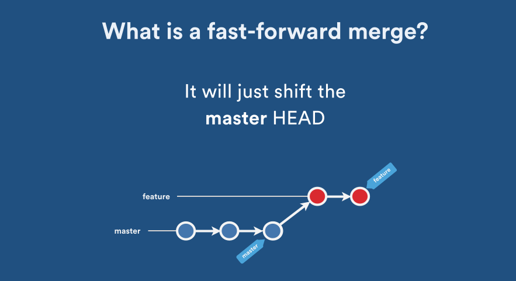
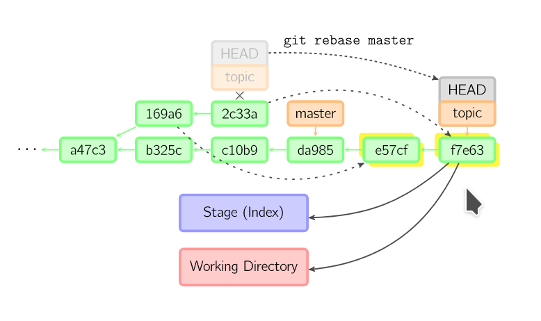
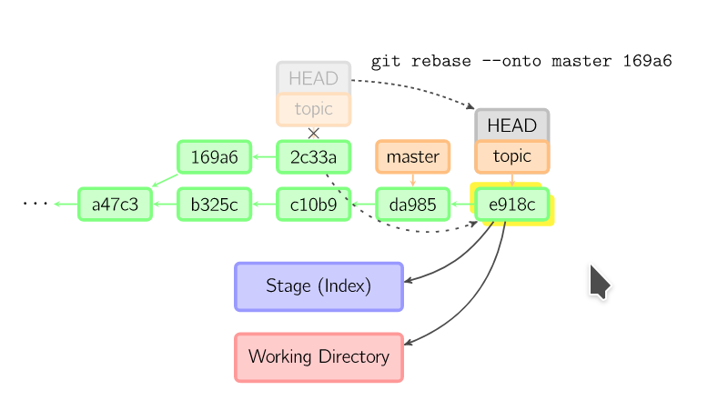

#### No Fast-forward merge

master branch üzerinde feature branch i oluştuktan iki commit olsun. feature üzerinde ise üç adet commit olsun. T anında master üzerinde iken _git merge feature_ komutu çalıştırıldığında __yeni bir commit oluşur__ ve bu commit metadatasında (_git cat-file -p COMMIT_ID_) __iki adet parent__ oluşur. Birtanesi master diğer ise feature branch ini gösterir. 

şekilde de görüleceği üzere master branch i ayrılır (diverged).


_git log_ komutu iel check ettiğimizde açıklamlarda _Merge: 7222f6a c952e91_  şeklinde iki parent görülebilir.


**örnek uygulama**


alttaki görüntüyü almak için öcelikle alttaki komutu çalıştırmalısınız

```
git config --global alias.t3  "log --graph --abbrev-commit --decorate --format=format:'%C(bold blue)%h%C(reset) - %C(bold cyan)%aD%C(reset) %C(bold green)(%ar)%C(reset)%C(bold yellow)%d%C(reset)%n''          %C(white)%s%C(reset) %C(dim white)- %an%C(reset)' --all"

git t3
```


merhaba branch i master ın ilk commitinden sonra ayrılmış. dikkaet edilirse master ın ikinci commitinden sonra da nasilsiniz branchi ayrılmış. graifk yanlış nalaşılmasın a32122c id li commit in merhaba branch i ile ilgisi yok. a32122c id li commit master ın ikinci commiti ve bu koldan nasislsin branch i ayrılmış.

```
git checkout master
git merge merhaba --ff
```


ancak sonuç beklediğimiz gibi olmadı. çünki -ff komutu öncelikle --ff-only parametresi fast forward commit yapılıp yağpılamayacağını test eder eğer yapılamaycaksa yeni bir commit oluşturarak problemleri (conflict) çözer veya çözdürür. prki bizim bu ortamımızda neden --ff-only çalışmadı? çünkü master branch inde merhaba branch i oluşturulduktan sonra değişiklikler oldu. --ff-only nin çalışabilimesi için masterdaki historinin masrhaba branchinde olması gerekirdi.

böyle bir durumu test etmek için commit history de gei gidelim.

```
git reflog
```


HEAD@{18} mantıklı görünüyor. merhaba branch i işini bitirmiş ve master branch i değişikliğe geçmeden önceki durum.

```
git reset --hard HEAD@{18}
```


dikkaet edilirse master üzerinde commit 1 üzerinde HEAD.


daha sonra --ff-only parametresi ile merge işlemini gerçeleştiriyoruz.

```
git merge merhaba --ff-only
Updating 21c0fec..7715b76
Fast-forward
 master1.txt  | 3 ++-
 merhaba1.txt | 1 +
 merhaba2.txt | 1 +
 3 files changed, 4 insertions(+), 1 deletion(-)
 create mode 100644 merhaba1.txt
 create mode 100644 merhaba2.txt

```
dikkaet edilirse komut sonuvunda Updating 21c0fec..7715b76 diye bir satır var. bu satır aslında head in nederen nereye hareket ettiğini gösteriyor. harekete göre HEAD merhaba branch i üzerindeki son commit üzerinde. böylece yeni bir commit oluşturmadan sadece HEAD i hareket ettirerek commit yapmış olduk. 


peki bu durumda branch imizi kontrol edecek olursak halen master üzerinde olduğumuzu görebiliriz.

```
git branch
* master
  merhaba
  nasilsin
```

şimd ibu noktada acaba nasilsin branch i ile birleşebilir miyiz diye düşünelim. tree ye dikkat edersek master ın şuan bulunduğu yer itibariyle nasilsin branch i ayrıldıktan sonra master a merhaba ile birleşiminden sonta başka commitlerin eklendiği görülüyor. bu durumda bunu yapamayız.

```
git merge nasilsin --ff-only
fatal: Not possible to fast-forward, aborting.
```
ancak --ff komutu ile yapacak olur sak bu mümkün ocaktır. çünkü arka tarafta --no-ff çalışcaktır ve bir commit create edilerek problemler çözülecektir yada otomatik çözülemeyenler için bize conflictleri manule çözebilmememiz için imkan verilecektir.

```
git merge nasilsin --ff
Merge made by the 'recursive' strategy.
 master2.txt   | 2 ++
 nasilsin1.txt | 1 +
 nasilsin2.txt | 1 +
 3 files changed, 4 insertions(+)
 create mode 100644 master2.txt
 create mode 100644 nasilsin1.txt
 create mode 100644 nasilsin2.txt
```


#### Fast-forward merge 

_git merge_ komutu çalıştırıldığında default olan budur yani --ff otomatik olarak çalıştırlır. bu merge tipinde dallanma, ayrılma (diverged) oluşmaz. __yeni commit oluşmaz__ bunun yerine master branch in HEAD'i en feature branch üzerindeki son commite taşınır. Tek __bir parent__ oluşur/vardır.

üstteki şekilde sağdaki fastf-forward merge i gösterir.




rebase den farklı olarak yeni commitler oluşmaz halihazırda var olan commitler olduğu gibi kullanılır. rebase de ise feature branch indeki commitler copyalnarak yeni commitler oluşturulur ve eskileride silinir.


**örnek uygulama**


alttaki görüntüyü almak için öcelikle alttaki komutu çalıştırmalısınız

```
git config --global alias.t3  "log --graph --abbrev-commit --decorate --format=format:'%C(bold blue)%h%C(reset) - %C(bold cyan)%aD%C(reset) %C(bold green)(%ar)%C(reset)%C(bold yellow)%d%C(reset)%n''          %C(white)%s%C(reset) %C(dim white)- %an%C(reset)' --all"

git t3
```


merhaba branch i master ın ilk commitinden sonra ayrılmış. dikkaet edilirse master ın ikinci commitinden sonra da nasilsiniz branchi ayrılmış. graifk yanlış nalaşılmasın a32122c id li commit in merhaba branch i ile ilgisi yok. a32122c id li commit master ın ikinci commiti ve bu koldan nasislsin branch i ayrılmış.

```
git checkout master
git merge merhaba --ff
```


#### Squash Merge

Burada ise __yeni bir commit oluşur__. aşağıdaki şekilde en sağdaki squash merge e bakacak olursak feature branch de oluşturulan C4 ve C5 commitleri tekbir committe birleşerek develop branch indeki C3 e bağlanmıştır. Bu commit tipinde yeni oluşan branch de __tek bir parent__ vardır ancak commit mesajında feature branch indeki iki commitinde mesajları birlikte tuturlur.


no fast forwar dan farklı olarak 2 adet parent yoktur.


**örnek uygulama**

alttaki görüntüyü almak için öcelikle alttaki komutu çalıştırmalısınız

```
git config --global alias.t3  "log --graph --abbrev-commit --decorate --format=format:'%C(bold blue)%h%C(reset) - %C(bold cyan)%aD%C(reset) %C(bold green)(%ar)%C(reset)%C(bold yellow)%d%C(reset)%n''          %C(white)%s%C(reset) %C(dim white)- %an%C(reset)' --all"

git t3
```


merhaba branch i master ın ilk commitinden sonra ayrılmış. dikkat edilirse master ın ikinci commitinden sonra da nasilsiniz branchi ayrılmış. graifk yanlış anlaşılmasın a32122c id li commit in merhaba branch i ile ilgisi yok. a32122c id li commit master ın ikinci commiti ve bu koldan nasilsin branch i ayrılmış.

merhaba branch i üzerindeki tüm commitleri tek bir commit create ederek master branch i üzerine commitlemek için altttaki komutu çalıştırıyoruz.

```
git checkout master
git merge merhaba --squash
git commit # burayı çalıştırmak zorundayız atlamayınız
```


gözrüldüğü üzere merhaba branch inde yer alan 2 yeni branch master sonuna eb1026d id li bir commit create edilerek merge işlemi tamamlandı.

#### Cherry-Pick

başka bir branchdeki bir commiti diğer bir branch a __kopyalayarak__ commit lemektir.

yani diğer branch de commitler halen durmaktadır.


feature branch inden kopyalanan commit feature branch inden silinmez.

__tek bir parent oluşur yeni commitlerde__.  ancak şuan dikkaet lazım, aynı koddan iki adet oluşmaktadır ve commit id leri farklı olmaktadır. git history çizgisini bozmaktadır.


**örnek uygulama**

alttaki görüntüyü almak için öcelikle alttaki komutu çalıştırmalısınız

```
git config --global alias.t3  "log --graph --abbrev-commit --decorate --format=format:'%C(bold blue)%h%C(reset) - %C(bold cyan)%aD%C(reset) %C(bold green)(%ar)%C(reset)%C(bold yellow)%d%C(reset)%n''          %C(white)%s%C(reset) %C(dim white)- %an%C(reset)' --all"

git t3
```


merhaba branch i master ın ilk commitinden sonra ayrılmış. dikkat edilirse master ın ikinci commitinden sonra da nasilsiniz branchi ayrılmış. graifk yanlış anlaşılmasın a32122c id li commit in merhaba branch i ile ilgisi yok. a32122c id li commit master ın ikinci commiti ve bu koldan nasilsin branch i ayrılmış.


merhaba branch i üzerinde ki 5e20620 id li commiti master üzerine kopyalayalım. 


```
git checkout master

git cherry-pick 5e20620
CONFLICT (modify/delete): merhaba1.txt deleted in HEAD and modified in 5e20620... merhaba2 commit 2. Version 5e20620... merhaba2 commit 2 of merhaba1.txt left in tree.
error: could not apply 5e20620... merhaba2 commit 2
hint: after resolving the conflicts, mark the corrected paths
hint: with 'git add <paths>' or 'git rm <paths>'
hint: and commit the result with 'git commit'

```
bu hareket ile aslında 5e20620 id li commiti master a kopyalarken parent ından koparmış oluyoruz. bir öceki adımda ise merhaba1.txt adında bir dosya create edilmişti ancak bu bağ yeni birleşme ile yok olduğu için bu dosyanın silinmesi ve kopyalamaya çalıştığımız 5e20620 id li committe de merhaba2.txt adında bir dosya create edilediği için index(stage) e eklenemsi gerekiyor. tam bu sırada git status komutyu çalıştırırsak aynı şeyi göreceğiz.

```
git status
On branch master
You are currently cherry-picking commit 5e20620.
  (fix conflicts and run "git cherry-pick --continue")
  (use "git cherry-pick --skip" to skip this patch)
  (use "git cherry-pick --abort" to cancel the cherry-pick operation)

Changes to be committed:
        new file:   merhaba2.txt

Unmerged paths:
  (use "git add/rm <file>..." as appropriate to mark resolution)
        deleted by us:   merhaba1.txt

```

dosyarları add/rm yapıp commitliyoruz.

```
git add .
git commit

git t3
```


#### Rebase


rebase i aslında __görüntü olarak fast-forward a benzetebiliriz__. Ancak yapısı ve oluşma şekli ondan çok farklıdır. 

şöyle düşünebiliriz cherry-pick ile tek tek kopyalama yaprak feature branch den master branch a kopyalama yapıp daha sonra kopyaladığımız feature branch i sildiğimizi düşünelim. bu tam olarak rebase i açıklar. Tabiiki rebase bunu tek harektle yapmış olur.


**örnek çalışma**


alttaki görüntüyü almak için öcelikle alttaki komutu çalıştırmalısınız

```
git config --global alias.t3  "log --graph --abbrev-commit --decorate --format=format:'%C(bold blue)%h%C(reset) - %C(bold cyan)%aD%C(reset) %C(bold green)(%ar)%C(reset)%C(bold yellow)%d%C(reset)%n''          %C(white)%s%C(reset) %C(dim white)- %an%C(reset)' --all"

git t3
```


şimdi master branch ini merhaba üzerine rebase yapalım. normalde böyle bir şey yapmak mantıksız. Amacımız hem rebase komutunun mantığını anlamak hemde hat durumunda rebase i geri almak.

```
git checkout master

git rebase merhaba
```


görüldüğü üzere master branche inde rebase den önce yer alan a32111c ve 43bf8e1 commitlerini merhaba branch i üzerine kopyaladı. eski commitler artık yok yeni commit id leri de aşağıdaki gibi. 

a32111c --> 1ca197
43bf8e1 --> f72416d

dikkat edilirse master branch in ilk commiti taşınmadı sebebi ise merhaba branche  master branchin ilk commitinden sonra oluşturuldu. yani ayrım commit 1 den sonra başladı. commit 2 den sonra başlasaydı commit 2 den sonra kopyalama yapılacaktı. 

aslında yapmak istediğimiz merhaba branch ini master üzerine getirmekti. Bu durumda rebase i geri almak için reflog lara bakmamız gerekiyor. 

```
git reflog
```


listede branch ler üzerinde yaptığımız hareketleri görebiliriz. Dikkat edilirse rebase işleminden önce  en son HEAD@{8} da nasılsın branch i üzerinde "nasılsınızdan master a mesaj" diye bir commit atmışız ve HEAD@{7} de de master branch ine geçiş yapmşız. bu durumda HEAD@{7} ye yani 43bf8e1 id li commit id ye dönmemiz yeterli oacaktır. 

```
git reset --hard 43bf8e1 # yada HEAD@{7}
```
yeni duruma bakacak olursak rebase den önceki halimize geri dömnüş olduğumuzu görebiliriz.


şimdi doğru kodu çalıştıralım.

```
git checkout merhaba

git rebase master
```


dikkat edersek merhaba branch i üzerindeki commitler master branch inin üzerine kopyalanmış.


rebase komutu şu şekilde de çalıştırılabilirdi.

```
git rebase master merhaba

# biz diğer version olan merhaba branch i üzerindeyken alttaki komutu çalıştırmıştık

git rebase master
```

peki bunun mantığı nedir? sanki komut tersinden çalışıyormuş gibi görünüyor ama değil. aslında hangi branch üzerinde işlem yapıyorsak onda olmamız gerekiyor. örneğin merge _git merge_ komutunda da diyelimki master üzerinde diğer bir 


**resources**

- https://stackoverflow.com/questions/28140434/is-there-a-difference-between-git-rebase-and-git-merge-ff-only
- https://blog.developer.atlassian.com/pull-request-merge-strategies-the-great-debate/
- https://medium.com/@mena.meseha/git-merge-vs-rebase-556563b26431


## extralar


### Merge Strategies


- **Fast Forward ff:** 


```        
        C - D - E           bugfix
      /
A - B                       master

```

git merge --ff

```
A - B - C - D - E           master/bugfix
```

- **No fast-forward no-ff:**


```        
        C - D - E           bugfix
      /
A - B                       master

```

git merge --no-ff

```
        C - D - E           bugfix
      /           \
A - B ------------ F        master

```


- **Recursive strategy**

üstteki ff den farklı olarak master da yerinde sabit durmadan devam etmiş.

```
        C - D - E           bugfix
      /
A - B - F - G               master

```

git merge --no-ff

```
        C - D - E           bugfix
      /           \
A - B - F - G ----- H       master

```

- **Squash merge**

```

        C - D - E           bugfix
      /
A - B - F - G               master

```
git merge --squash

```
        C - D - E           bugfix
      /
A - B - F - G - CDE         master
```
### Merge,Cherry Pick and Rebase


[merge ve rebase hakkında daha fazla detay için bu sayfayı kullanbilirsiniz](merge_rebase.md)

- **merge**


- **cherry pick**


- **rebase**



üstteki komut ile topic branchindeki commitler sırasıyla master a uygulanız.

alttaki komutlr yani --onto ile topic branchinde ne kadar geriye gidileceği belirtiliyor.




