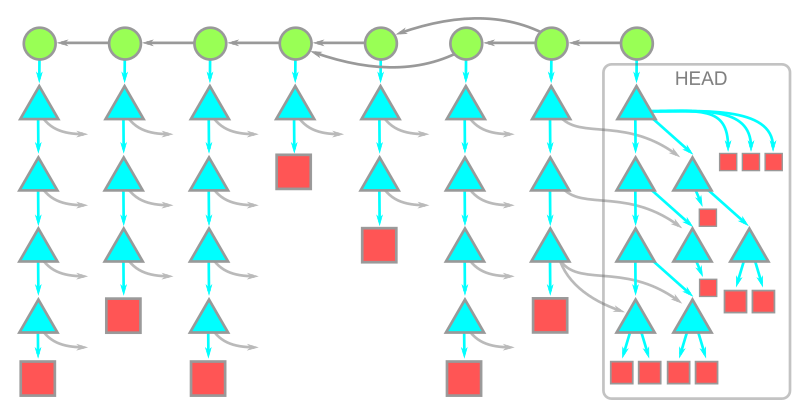
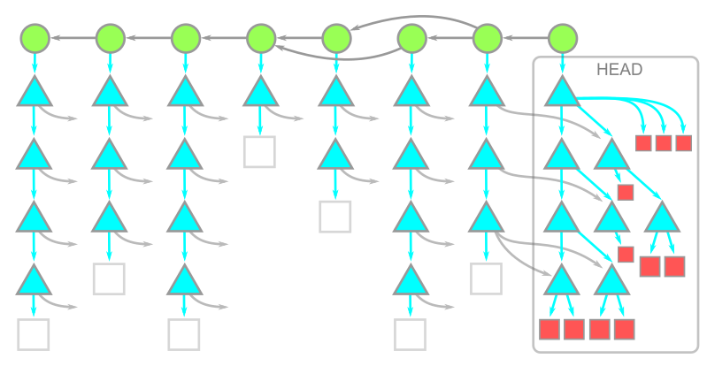
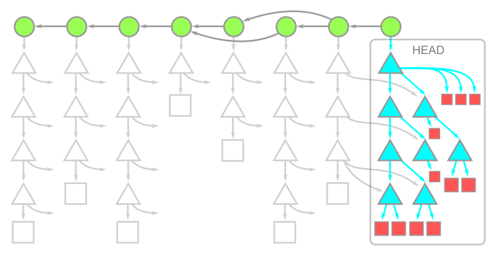
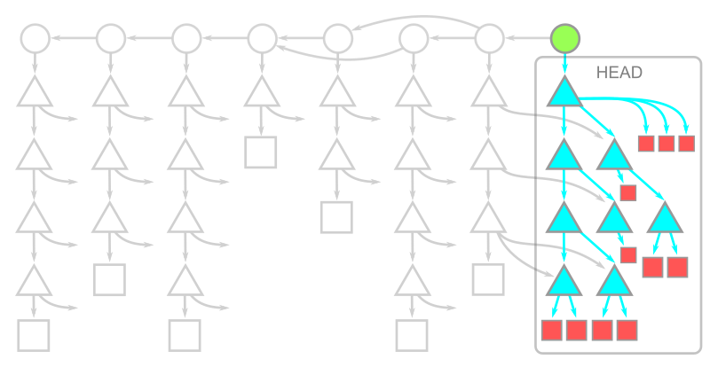

# Git Filters

git filterlar aslında bir çok ana komuta opsiyon olarak eklenebiliyor.

örnekler

```
git clone --filter=<filter-spec> git_repo_url 

git filter-branch [--setup <command>] [--subdirectory-filter <directory>]
	[--env-filter <command>] [--tree-filter <command>]
	[--index-filter <command>] [--parent-filter <command>]
	[--msg-filter <command>] [--commit-filter <command>]
	[--tag-name-filter <command>] [--prune-empty]
	[--original <namespace>] [-d <directory>] [-f | --force]
	[--state-branch <branch>] [--] [<rev-list options>…​]

```


# filter-spec

flter comutu aşağıdaki gibi birbiri arkasına da çağrılabilir
```
--filter=combine:<filter1>+<filter2>+…​<filterN>
```
daha önce tanımlı filterları silmek için
```
--no-filter
```

filter-spec yerine gelecek filtreler aşağıda detaylandırılmıştr.

- https://stackoverflow.com/questions/49917616/what-is-the-git-clone-filter-options-syntax
- https://github.blog/2020-12-21-get-up-to-speed-with-partial-clone-and-shallow-clone/

## bütün blobları atlamak  

--filter=blob:none

örnek kullanım: clone lama yaparken none olduğu için blobları almaz

```
git clone --filter=blob:none git_url
```
## treeless clone

tree leri almadan clone lama yapar

```
git clone --filter=tree:0 <url> creates a treeless clone. 
```

## belli derinlikte clone lama yapmak için

```
git clone --depth=1 <url> creates a shallow clone. 
```


## şekiilli anlatım

**full clone**




**blobless clone**





**treeless clone**





**shallow clone**




## Belli bir size üzerini atlamak için 

yani belli bir byte a kadar olann doslayları clone lama için

--filter=blob:limit=1024k

-k: kilobyte
-m: magabyte
-g: gigabyte

```
--filter=blob:limit=1m
```

## klasör ve dosya filtrelemek (sparse)

```
--filter=sparse:oid=shiny-app/.gitfilterspec
```

sparse hem sparse-checkot da hem de git clone üerinde filtreleme yaparken kullanılabilir.

detaylart için sparse-checkout dökümanını okuyunuz.


- https://docs.gitlab.com/ee/topics/git/partial_clone.html#filter-by-file-path
- https://git-scm.com/docs/git-rev-list#Documentation/git-rev-list.txt---filterltfilter-specgt


## git filter-branch 


üzerinde çalışılan branch üzerindeki bütün commitlerde omut çalıştırır.

```
git filter-branch --index-filter 'mv "new-file" "old_file"' HEAD
```


--tree-filter <command>
This is the filter for rewriting the tree and its contents. The argument is evaluated in shell with the working directory set to the root of the checked out tree. The new tree is then used as-is (new files are auto-added, disappeared files are auto-removed - neither .gitignore files nor any other ignore rules HAVE ANY EFFECT!).

--index-filter <command>
This is the filter for rewriting the index. It is similar to the tree filter but does not check out the tree, which makes it much faster. Frequently used with git rm --cached --ignore-unmatch ..., see EXAMPLES below. For hairy cases, see git-update-index[1].

--parent-filter <command>
This is the filter for rewriting the commit’s parent list. It will receive the parent string on stdin and shall output the new parent string on stdout. The parent string is in the format described in git-commit-tree[1]: empty for the initial commit, "-p parent" for a normal commit and "-p parent1 -p parent2 -p parent3 …​" for a merge commit.

--msg-filter <command>
This is the filter for rewriting the commit messages. The argument is evaluated in the shell with the original commit message on standard input; its standard output is used as the new commit message.

--commit-filter <command>
This is the filter for performing the commit. If this filter is specified, it will be called instead of the git commit-tree command, with arguments of the form "<TREE_ID> [(-p <PARENT_COMMIT_ID>)…​]" and the log message on stdin. The commit id is expected on stdout.

As a special extension, the commit filter may emit multiple commit ids; in that case, the rewritten children of the original commit will have all of them as parents.

You can use the map convenience function in this filter, and other convenience functions, too. For example, calling skip_commit "$@" will leave out the current commit (but not its changes! If you want that, use git rebase instead).

You can also use the git_commit_non_empty_tree "$@" instead of git commit-tree "$@" if you don’t wish to keep commits with a single parent and that makes no change to the tree.

--tag-name-filter <command>
This is the filter for rewriting tag names. When passed, it will be called for every tag ref that points to a rewritten object (or to a tag object which points to a rewritten object). The original tag name is passed via standard input, and the new tag name is expected on standard output.


- https://manishearth.github.io/blog/2017/03/05/understanding-git-filter-branch/


What git filter-branch will do is for each commit in the specified branch, apply filters to the snapshot, and create a new commit. The new commit’s parent will be the filtered version of the old commit’s parent. So it creates a parallel commit DAG.


git-filter-branch - Rewrite branches

https://git-scm.com/docs/git-filter-branch


## git-filter-repo
- https://github.com/newren/git-filter-repo/

## --filter=(filter-spec)

```
git clone --filter=<filter-spec>
```