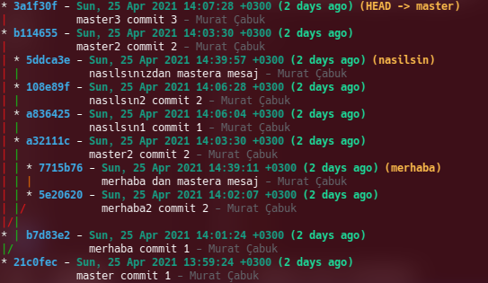
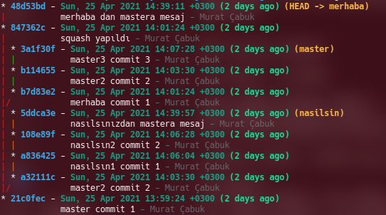
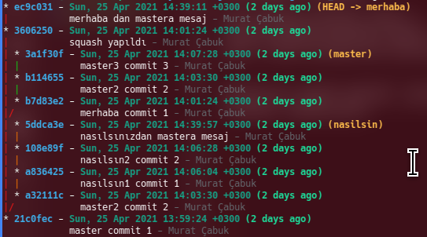
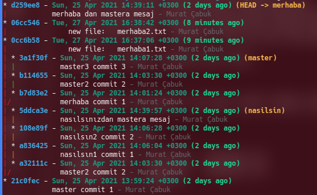
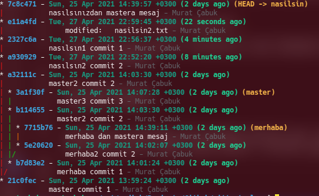
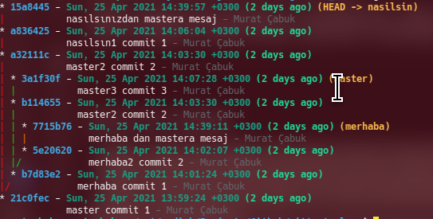

# Interactive Rebase

- https://git-scm.com/docs/git-rebase
- https://git-scm.com/book/en/v2/Git-Tools-Rewriting-History
  

Öncelikle baız temel kuralları tekrar etmekde fayda var.
- shared commitler üzerinde asla rebase yapmayınız. remote repolar da özllikle geçmişte yapılcak değişiklikler çok yorucu olabilir. Ancak yine örneğin paylaşılmaması gereken bir bilgi history ye yazıldıysa silinmesi gerekebilir.
- Shared history leri asla değiştirmemelisiniz.

bu sebeple geriye dönük yapmak istediğimiz değişiklikleri remote merge işlemlerimizden sonraki local commitlerde yapmak mantıklı olacaktır. 

BFG aracı ile tüm history den belli bir doya veya metni silebilirsiniz. detaylar için https://docs.github.com/en/github/authenticating-to-github/removing-sensitive-data-from-a-repository

**git blame komutu bir dosyada yapılmış tüm değişimleri ve commit bilgilerini verir.**

```
git blame DOSYA_ADI
```

**önemli bir not:  interactive rebase de base olarak seçilen commit rebase işlemine dahil edilmez. Yani verilen commit den sonraki ilk commit base olarak kullanılır. peki root commitin bizzat kendisinde işlem yapmamız gerekseydi yani daha öncesinde commit olamayan bir commit ozman --root eklememiz gerekiyor.**


normal rebase aslında sadece bir branch in başka bir branch in HEAD ine bağlanmasını sağlar. Ancak Interactive rebase çok daha fazlasını yapar.bütün commitlerin history sinde değişiklik yapabilir. bu bağlamda interactive rebase normal rebase i de kapsamaktadır.

örneklerimiz için alttaki projeyi kullanıyor olacağız.



## Squash (geçmişteki 2 veya daha fazla commiti birleştirmek)

diyelimki merhaba branch i üzerinde b7d83e2 commiti ile ondan bir sonraki 5e20620 commitini birleştimek isteyelim. bunun için ilk committen bir önceki committen başlamamız gerekir. örneğimize göre ilk commit aslında master bracnh i üzerindeki 21c0fec commiti. Ancak bu commit merhaba branch ininde master ile bağlı olduğu commit bu nedenle öncelikle merhaab branchine geçiş yapıp daha sonra interactive rebase i çalıştırmalıyız.

eğer rebase i root dan başlatmamız gerekseydi ozaman --root opsiyonunu eklememiz gerekirdi.

```
git checkout merhaba

git rebase -i 21c0fec

pick b7d83e2 merhaba commit 1
pick 5e20620 merhaba2 commit 2
pick 7715b76 merhaba dan mastera mesaj

# Rebase 21c0fec..7715b76 onto 21c0fec (3 commands)
#
# Commands:
# p, pick <commit> = use commit
# r, reword <commit> = use commit, but edit the commit message
# e, edit <commit> = use commit, but stop for amending
# s, squash <commit> = use commit, but meld into previous commit
# f, fixup <commit> = like "squash", but discard this commit's log message
# x, exec <command> = run command (the rest of the line) using shell
# b, break = stop here (continue rebase later with 'git rebase --continue')
# d, drop <commit> = remove commit
# l, label <label> = label current HEAD with a name
# t, reset <label> = reset HEAD to a label
# m, merge [-C <commit> | -c <commit>] <label> [# <oneline>]
# .       create a merge commit using the original merge commit's
# .       message (or the oneline, if no original merge commit was
# .       specified). Use -c <commit> to reword the commit message.
#
# These lines can be re-ordered; they are executed from top to bottom.
#
# If you remove a line here THAT COMMIT WILL BE LOST.
#
# However, if you remove everything, the rebase will be aborted.
#
# Note that empty commits are commented out
```

biz şuan squash olan adımı yapıyor olacağız. bu dökümdanda bütün hepsinin üzerinden geçiyor olacağız.

bizim amacımız alttaki iki tanesini birleştirmek. bu arada şuna dikkt etmemiz geekiyor en eski commit en üstte görünüyor olacak. sebebi ise eskiden yeniye doğru gitmemiz gerekiyor çünki eskide yaptılarımız yeni olanları da etkileyecek ve düzeltmeler yapamamız geekebilir. tabi böyle bir durum belki kod bloğu silmemiz, eklememiz yada bir dosyayı olduğu gibi silmemiz vb durumlarda belki geçerli olabilir.

- pick : demek değişiklik istemiyorum olanı al
- reword: commit mesajını değiştir
- squash : iki commiti birleştir fakat birleştirmeyi bir öceki commitle yap
- edit: Rebase’i durdurur ve commit uzerinde degisiklik yapabilmenizi saglar. Istediginiz degisikligi yapip rebase islemine devam ederseniz (git rebase --continue) o commitin icerigi degisecektir. Ayrica eger rebase yaptiginiz commit birbiriyle veya commit mesaji ile alakasiz degisiklikler iceriyorsa ve siz bu commit ile alakasiz olan degisikligi farkli bir commit olarak kaydetmek istiyorsaniz rebase’den cikmadan commitleri yapip rebase islemini sonlandirdiginizda degisikliklerin farkli commitlere ayrildigini goreceksiniz. (kaynak : https://mesuutt.com/2016/07/git-rebase-interactive/)
- fixup: squash gibi commit’i kendinden once yapilan commit ile birlestirir. Tek farki commit mesaji olarak fixup olarak isaretlenen committen once yapilan commitin mesajini kullanir (kaynak : https://mesuutt.com/2016/07/git-rebase-interactive/).

yani eğer alttaki 2 taneyi birleştimek istiyorsak ikincisine squash yazmamız yeterli çünki parent ı listede üstte olan commit yani b7d83e2.

```
pick b7d83e2 merhaba commit 1
pick 5e20620 merhaba2 commit 2
```
ekranda ikinci commiti editleyip dosyayı kaydediyoruz.

```
pick b7d83e2 merhaba commit 1
squash 5e20620 merhaba2 commit 2
pick 7715b76 merhaba dan mastera mesaj
```

save leme işi tamamlanınca bize squash için geerekli commit mesajını editletiyor. mesajı editleyip tekar kaydediyoruz. ben squash yapıldı deyip kaydediyorum.

bu commitlerden birincisinde merhaba1.txt diye bir dosyaya "merhaba commit 1" ve ikinci committe de merhaba2.txt diye bir dosyaya "merhaba commit 2" yazmıştık.

ekrana gelen mesaj şu şekilde

```
[detached HEAD 847362c] squash yapıldı
 Date: Sun Apr 25 14:01:24 2021 +0300
 2 files changed, 2 insertions(+)
 create mode 100644 merhaba1.txt
 create mode 100644 merhaba2.txt
Successfully rebased and updated refs/heads/merhaba.

```

tekrar tree yapımıza bacak olursak b7d83e2, 5e20620 commitleri birleşerek 847362c commitinde birleştiği görülür. ancak bir fark daha var birleştirmeye dahil etmediğimiz merhabanın enson commiti olan 7715b76 commitide suqash yapılan comitin üzerine 48d53bd commiti olarak yeniden oluşturulmuş.



bir önceki tree yapısı


## Split Commmit (commitleri parçalara ayırmak)

ilk baştaki tree yapımızı hatırlayalım


örneğimiz için diyelimki tek bir committe iki doay update etmiş olalım ve bunları 2 ayrı commite bölmek isteyelim. 

bunun için önce iki commiti üstteki squash daki birleştirelim ve saha sonra da ayıralım. yine merhab branch i üzerindeki ilk iki commiti birleştiriyoruz.


```
git checkout merhaba

git rebase -i 21c0fec

pick b7d83e2 merhaba commit 1
squash 5e20620 merhaba2 commit 2
pick 7715b76 merhaba dan mastera mesaj
```

mesaja da "squash yapıldı" yazıyoruz ve önceki iki mesajıda koruyarak squash işlemini tamamlıyoruz.



attaki komutla birleşen committe neer olduğuna bi bakalım.

```
git show 3606250 --name-only 

commit 3606250c222cc5231569d3d6a35a0ed3bd30f924
Author: Murat Çabuk <muratcabuk@mail.com>
Date:   Sun Apr 25 14:01:24 2021 +0300

    squash yapıldı
    
    merhaba commit 1
    
    merhaba2 commit 2

merhaba1.txt
merhaba2.txt

```

görüldüğü üzere 2 adet dosyamız değişliğe uğramış. şimdi amacımız bunu eski haline geri getirmek. 

```
git rebase -i 21c0fec


edit 3606250 squash yapıldı
pick ec9c031 merhaba dan mastera mesaj
```

iki ayırmak istediğimiz commite edit yazıyoruz ve kaydediyoruz.

dosyaı kaydettiğimize aşağıdaki gibi bir ekranla karşılaşırız

```
Stopped at 3606250...  squash yapıldı
You can amend the commit now, with

  git commit --amend 

Once you are satisfied with your changes, run

  git rebase --continue

```
bu esnada eğer status a bakacak olursak aşağıdakiş gibi bir ekran göreceğiz

```
git status
interactive rebase in progress; onto 21c0fec
Last command done (1 command done):
   edit 3606250 squash yapıldı
Next command to do (1 remaining command):
   pick ec9c031 merhaba dan mastera mesaj
  (use "git rebase --edit-todo" to view and edit)
You are currently editing a commit while rebasing branch 'merhaba' on '21c0fec'.
  (use "git commit --amend" to amend the current commit)
  (use "git rebase --continue" once you are satisfied with your changes)

nothing to commit, working tree clean

```
log u inceleyecek olursak HEAD in 3606250 commiti (yani suqash için yni açılan commit) üzerinde olduğunu görebiliriz. ancak bizim split yapabilmek için bir önceki durumda olmamız gerekiyor.

```
git log --oneline

3606250 (HEAD) squash yapıldı
21c0fec master commit 1
```

önceki commite gitmek için

```
git reset --mixed HEAD~
```
daha sonra status a bakacak olursak. 2 adet dosyamızın stage(index) alaınında olmadığını yani track edilmediğini görebiliriz.

```
git status
interactive rebase in progress; onto 21c0fec
Last command done (1 command done):
   edit 3606250 squash yapıldı
Next command to do (1 remaining command):
   pick ec9c031 merhaba dan mastera mesaj
  (use "git rebase --edit-todo" to view and edit)
You are currently editing a commit while rebasing branch 'merhaba' on '21c0fec'.
  (use "git commit --amend" to amend the current commit)
  (use "git rebase --continue" once you are satisfied with your changes)

Untracked files:
  (use "git add <file>..." to include in what will be committed)
        merhaba1.txt
        merhaba2.txt

nothing added to commit but untracked files present (use "git add" to track)
```
şimdi bu dosyaları sırasıyle add ve commit yapacağız.

```
git add merhaba1.txt 
git commit -m "new file:   merhaba1.txt"

git add merhaba2.txt 
git commit -m "new file:   merhaba2.txt"
```

takrar status a bakacak olursak rebase akışının tamamlanmadıını görebiliriz. 

```
git status

interactive rebase in progress; onto 21c0fec
Last command done (1 command done):
   edit 3606250 squash yapıldı
Next command to do (1 remaining command):
   pick ec9c031 merhaba dan mastera mesaj
  (use "git rebase --edit-todo" to view and edit)
You are currently editing a commit while rebasing branch 'merhaba' on '21c0fec'.
  (use "git commit --amend" to amend the current commit)
  (use "git rebase --continue" once you are satisfied with your changes)

nothing to commit, working tree clean

```

bie logları inceleyelim. iki adet commit oduğunu görebiliriz.

```
git log --oneline

06cc546 (HEAD)  new file:   merhaba2.txt
0cc6b58         new file:   merhaba1.txt
21c0fec master commit 1

```
rebase işmenini devam ettirdiğimizde başka adım olmadığı için rebase tamamlanmış olacak.

```
git rebase --continue 
Successfully rebased and updated refs/heads/merhaba.
```
tekrar tree yi görebiliriz.




merhaba branch ine dikkat edilecek olursa 0cc6b58, 06cc546 id li 2 adet commit eklendiği görülebilir. squash dan sonra 1 adetdi burası altta bir önceki halini de görebilirsiniz. 

Ancak burada ilginç bir duru var dikkat edilirse b7d83e2 id li commit master branch inden silinmemiş ki bu gayet mantıklı. çünki bu commit aynı zamanda master branch in ikinci commiti.

Altta bir önceki versişyonda da squash yaptığımızda bu comitin saklandığını görebiliriz.


## Reordeing (commitlerin sırasını değiştirmek)

ilk baştaki tree yapımızı hatırlayalım


nasilsin branch i üzernde 108e89f ile 108e89f commitlerinin yerini değiştimek istiyoruz. 

```
git checkout nasilsin

# bir önceki commiti seçiyoruz
git rebase -i a32111c 

# ikisi yer değiştirildi

pick 108e89f nasılsın2 commit 2
pick a836425 nasılsın1 commit 1
pick 5ddca3e nasılsınızdan mastera mesaj

```
kaydettiğimizde conflict olduğuna dair mesaj alıyoruz.

```
git rebase -i a32111c
CONFLICT (modify/delete): nasilsin1.txt deleted in HEAD and modified in 108e89f... nasılsın2 commit 2. Version 108e89f... nasılsın2 commit 2 of nasilsin1.txt left in tree.
error: could not apply 108e89f... nasılsın2 commit 2
Resolve all conflicts manually, mark them as resolved with
"git add/rm <conflicted_files>", then run "git rebase --continue".
You can instead skip this commit: run "git rebase --skip".
To abort and get back to the state before "git rebase", run "git rebase --abort".
Could not apply 108e89f... nasılsın2 commit 2
```
bu nedenle önce conflict i çözmemiz grekiyor.

ilk olarak status a bir bakalım 

```
git status
interactive rebase in progress; onto a32111c
Last command done (1 command done):
   pick 108e89f nasılsın2 commit 2
Next commands to do (2 remaining commands):
   pick a836425 nasılsın1 commit 1
   pick 5ddca3e nasılsınızdan mastera mesaj
  (use "git rebase --edit-todo" to view and edit)
You are currently rebasing branch 'nasilsin' on 'a32111c'.
  (fix conflicts and then run "git rebase --continue")
  (use "git rebase --skip" to skip this patch)
  (use "git rebase --abort" to check out the original branch)

Changes to be committed:
  (use "git restore --staged <file>..." to unstage)
        new file:   nasilsin2.txt

Unmerged paths:
  (use "git restore --staged <file>..." to unstage)
  (use "git add/rm <file>..." as appropriate to mark resolution)
        deleted by us:   nasilsin1.txt

```

yeni bir dosya aklendiğini (Changes to be committed böülümünde nasilsin2.txt ) ve bir dosyanın da unmerged şekilde beklediğini gösteriyor (Unmerged paths: deleted by us:   nasilsin1.txt).

unmerged durumunda blyle bir durumun olmas aslında gayet normal. çünki 2. commiti 1. yerine alıyoruz dolayısıyla parent değişiyor ve bir önceki (şuan unmerged durumundaki silinecek nasilsin1.txt commitinin oduğu) commit bu durumda yapılmamış olacak ve dolayısıyla dosya da olmuyor olacak. Ancak sistem bu silme işlemini onaylamamızı istediği için merge işlemini yapamıyor. biz dosyı add koutu ile stage(index) alanına ekler commit eder ve rebaseu continue dersek bir sonraki adıma geçebiliriz. aslında bir sonraki adımda da bize bu dosyanın create edilmesi gerktiği ile ilgili bir conflict çözdürecek. çünki bu dosya yer değişiminden sonra create olmuş olacak.

ikinci conflict de şu şekilde

```
git status
interactive rebase in progress; onto a32111c
Last commands done (2 commands done):
   pick 108e89f nasılsın2 commit 2
   pick a836425 nasılsın1 commit 1
Next command to do (1 remaining command):
   pick 5ddca3e nasılsınızdan mastera mesaj
  (use "git rebase --edit-todo" to view and edit)
You are currently rebasing branch 'nasilsin' on 'a32111c'.
  (fix conflicts and then run "git rebase --continue")
  (use "git rebase --skip" to skip this patch)
  (use "git rebase --abort" to check out the original branch)

Unmerged paths:
  (use "git restore --staged <file>..." to unstage)
  (use "git add <file>..." to mark resolution)
        both added:      nasilsin1.txt
```
ilgili dosyayı add yapmdan önce içeriğpine bir bakalım

```
<<<<<<< HEAD
nasılsın2 commit 2
=======
nasılsın1 commit 1
>>>>>>> a836425... nasılsın1 commit 1

```
görüldüğü üzere bu dosyaya her iki commitinde satırları eklenmiş ancak bizim beklentimiz sadece "nasılsın1 commit 1" yazması çünki nasilsin1.txt doyasında bu yazıyordu daha önce.


daha sonra add ve commit yapıyoruz. 

ancak birde ilk conflict eklenmesini içine bakmadan kabul ettiğimiz nasilsin2.txt dosyasının içine bir bakalım.

```
cat nasilsin2.txt 
nasılsın1 commit 1
```

isterseniz bu doyayıda ilk halindeki metinle yani "nasilsin2 commit 2" oalrak değiştirelim daha sonra add ve commit yapıp rebase i continue yapalım.



dikkaet edilirse "nasilsin2 commit 2" mersajlı commit ile  "nasilsin1 commit 1" yer değiştirmiş. ancak fazladan birde e11a4fd id li commit eklenmişl o da bizim hatamız oldu aslında. ilk dosyaları yer değiştirirke içini kontrol etmediğimiz commit 2 nin içeriğini sonradan değiştirmiş olduk.

önceki hali


## Dropping Commit (commit silmek)

ilk durumumuzu görelim


diyerlimki nislsin branch i üzerindeki 108e89f id li commiti silmek isiyoruz.

bir önceki commitle başlıyoruz.

```
git checkout nasilsin

git rebase -i a836425 

drop 108e89f nasılsın2 commit 2
pick 5ddca3e nasılsınızdan mastera mesaj
```
ilgili commite drop yazıyoruz ve kaydediyoruz. eğer conflict çıkarda çözmemiz gerekiyordu. ancak sildiğimiz commit bchild commitleri etklemediği içn problem yaşamadık.



görüleceği üzere "nasilsin2 commit 2" mesajlı commit silindi.


## Rebase devam ederken bir sonraki rebase adımını değiştirmek

akrak arkaya yapılacak rebase işlemlerlerinde baze bir adımın ciddi problemler oluşturacağın9 farkedebiliriz. örneğin il rebase adımlarında değiştirdiğimiz bir doyayı sonraki rebase adımında silmeye çalışmak baya bir uğraş gerektirebilir. ayrıca bezen yanlışlık da yapılabilir.

rebase devam ederken rebase --continue demeden önce alttaki komutu çalıştırabiliriz. böylece sonraki rebase adımlarını editlemek mümkün olacaktyır.

```
git rebase --edit-todo
```
## exec comutu ile hata yakalamak

diyelimki interactive rebase yaparken yaptığımız değişiklerde kodumuzdaki unit testlerin çalıştırılmasını ve eğer geçerse rebase e devam etmeyi yada abort etmeyi istiyoruz. yada örneğin commit de ki dosylarınm hepsine birşeyler yazıp commitlemek isiyoruz. yada bizim örneğimizde nasilsin branch i üzerinde son committe eeditleme yaparak yeni  bir dosya ekeleyip içine merhaba yazmak ve rebase devam ederken dosya içinde merhaba yazıp yazmadığını kontrol etmek istiyoruz diyelim. eğer merhaba yazmıyorsa rebase i abort edeceğiz.


```

git rebase -i 108e89f

edit 5ddca3e nasılsınızdan mastera mesaj
exec grep merhaba merhaba.txt; [ $? -eq 0 ] && echo "yes" || echo "no";
```

bir adet merhaba adında dosya ekleyip içine merhaba yazıyoruz.


```
git rebase --continue
Executing: grep merhaba merhaba.txt; [ $? -eq 0 ] && echo "yes" || echo "no";
merhaba
yes
Successfully rebased and updated refs/heads/nasilsin.
```

eğer yes yerine 0 no yerine de 1 yazsaydık ve dosya içine de merhaba dışında balka birşey yazsaydır rebase continue hata verecek ve duracaktı. 


## hook scriptleri çalıştırmak

daha önce tanımlı hook ları görmek için .git kalsörü altındaki hooks klasörüne bakılabilir.

```
commit-msg.sample*
  
fsmonitor-watchman.sample*
post-update.sample*
applypatch-msg.sample*
pre-applypatch.sample*
pre-commit.sample*
pre-merge-commit.sample*
prepare-commit-msg.sample*
pre-push.sample*
pre-rebase.sample*
pre-receive.sample*
update.sample*
```

burada örneğin commitleri göndermeden önce yapılmasını sitediğimiz bir kontrol varsa pre-commit.sample doyasının adını pre-commit olarak değiştirerek içindekileri silim yada açıklama satırı yapıp aşağıdaki kodu ekleyelim. amacımız bir üstte yaptığımız örnekteki exec komutu örneğini yapmak.


alttaki kodu pre-commit dosysına yapıştırıyoruz.

```
grep merhaba merhaba.txt; [ $? -eq 0 ] && echo "yes" || exit 1;
```

daha sonra kurala uymayan bir commit yaspmayı denediğimizde commitin yapılamdığını görebbiliriz.

## push rebase to remote 


aslında bu asla önerilmiyor ama bazen yapmak gerekirse şu adımları takip etmek lazım.

duruma göre farklı admlar farklı sırada terih edilebilir.


aslında 4 farklı opsiyon var

```
# 1. opsiyon
git push <remote> <branch> -f
git push origin master -f # Example


# 2. opsiyon
git push <remote> -f
git push origin -f # Example

# 3. opsiyon
git push -f

# 4. ve en güvenilir opsion. remote branch üzerinde biz rebase işlemini tamamlamadan önce diğer developerlar bir şeyler yaptıysa onların commitlerini bozmamızı engeller.

git push <remote> <branch> --force-with-lease

```

şu adımlarda karar vermek için faydalı olabilir.

If you’re working on a team and need to rebase a shared branch, here are the steps:

- Make sure your team has committed and pushed any pending changes
- Ask your team to pause work on that branch temporarily
- Make sure you have the latest changes for that branch (git pull)
- Rebase, then git push origin yourbranch -f
- Have your team fix up their local branches with git checkout  yourbranch, git fetch and git reset --hard origin/ yourbranch

diğer bir yol remote dan branchi tamamen silip  yeni branch oluşturuop local ı pushlamak.    

- https://willi.am/blog/2014/08/12/the-dark-side-of-the-force-push/


# Clean History

- https://medium.com/@catalinaturlea/clean-git-history-a-step-by-step-guide-eefc0ad8696d
- https://ubuntu.com/blog/tricks-for-keeping-a-tidy-git-commit-history
- https://about.gitlab.com/blog/2018/06/07/keeping-git-commit-history-clean/
- https://spin.atomicobject.com/2017/04/23/maintain-clean-git-history/
- https://about.gitlab.com/blog/2018/06/07/keeping-git-commit-history-clean/
  

# Bütün commitleri değiştirmek

WARNING

git filter-branch has a plethora of pitfalls that can produce non-obvious manglings of the intended history rewrite (and can leave you with little time to investigate such problems since it has such abysmal performance). These safety and performance issues cannot be backward compatibly fixed and as such, its use is not recommended. Please use an alternative history filtering tool such as git filter-repo. If you still need to use git filter-branch, please carefully read SAFETY (and PERFORMANCE) to learn about the land mines of filter-branch, and then vigilantly avoid as many of the hazards listed there as reasonably possible.

- https://git-scm.com/docs/git-filter-branch#_examples

- https://git-scm.com/docs/git-filter-branch


# Ekstralar

#### Interactive Rebase

Interaktif rebase ile; deponun commit historysinde(gecmisinde) degisiklik yapabilir, commitleri birlestirebilir, commitleri silebilir veya commitlerin sirasini degistirebilirsiniz.


aşağıdaki komutu verdiğimizde git e yapmis oldugumuz son 3 commit uzerinde degisiklik yapmak istedigimizi belirtmiş oluyoruz. 

```
git rebase -i HEAD~3
```
karşımıza şuna benze bir liste çıkmuş olacak

```
pick 490dd3c Catalogue app created
pick d1ff06d Base templates created
pick f7edff3 Logging confs updated

# Commands:
# p, pick = use commit
# r, reword = use commit, but edit the commit message
# e, edit = use commit, but stop for amending
# s, squash = use commit, but meld into previous commit
# f, fixup = like "squash", but discard this commit's log message
# x, exec = run command (the rest of the line) using shell
# d, drop = remove commit
#
# These lines can be re-ordered; they are executed from top to bottom.
#
# If you remove a line here THAT COMMIT WILL BE LOST.
#
# However, if you remove everything, the rebase will be aborted.
#
# Note that empty commits are commented out
```

- pick: gelen listeyi editleyip başında pick yazısını bırakırsak belirttiğimiz sırada commitler alınmış gibi olacaktır daha doğrusu gibi deği gerçekten olacaktır.
- reword: Sadece commit mesajini degistirmek istiyorsaniz; mesajini degistirmek istediginiz commitin basindaki pick kelimesini reword ile degilstirin.
- edit:Rebase’i durdurur ve commit uzerinde degisiklik yapabilmenizi saglar. Istediginiz degisikligi yapip rebase islemine devam ederseniz (git rebase --continue) o commitin icerigi degisecektir. Ayrica eger rebase yaptiginiz commit birbiriyle veya commit mesaji ile alakasiz degisiklikler iceriyorsa ve siz bu commit ile alakasiz olan degisikligi farkli bir commit olarak kaydetmek istiyorsaniz rebase’den cikmadan commitleri yapip rebase islemini sonlandirdiginizda degisikliklerin farkli commitlere ayrildigini goreceksiniz.
- squash: Commitleri birlestirmek icin kullanilir. git rebase -i HEAD~3 komutunu calistirdigimizda gelen ekranda su sekilde degisiklik yapalim:


```
pick 490dd3c Catalogue app created
s f7edff3 Logging confs updated
pick d1ff06d Base templates created
```

Degisikligi yapip kaydettikten sonra:

f7edff3 hashli commit 490dd3c hashli commit(kendinden onceki commit) ile birlesecektir ve karsimiza yeni commit mesajini belirtebilecegimiz editor ekrani gelecektir. Bunuda kaydedip cikinca commit logumuz suna benzer birsey olacaktir.
```
$ git log --oneline
d1ff06d Base templates created
aabbccd Iki commit bir olunca samanlik seyran olur
077c05c confs updated
81ea1c6 Customer app created
c869e5c Initial commit
```
Burda dikkat edilecek nokra birlestirmek icin isaretledigimiz commit[ler] rebase ekraninda bir ust satirda yazan commit ile birlesti.
- fixup:squash gibi commit’i kendinden once yapilan commit ile birlestirir. Tek farki commit mesaji olarak fixup olarak isaretlenen committen once yapilan commitin mesajini kullanir.
- drop: Belirtilen commitleri siler.

Use git rebase. Specifically:

1. Use git stash to store the changes you want to add.
2. Use git rebase -i HEAD~10 (or however many commits back you want to see).
3. Mark the commit in question (a0865...) for edit by changing the word pick at the start of the line into edit. Don't delete the other lines as that would delete the commits.(^vimnote)
4. Save the rebase file, and git will drop back to the shell and wait for you to fix that commit.
5. Pop the stash by using git stash pop
6. Add your file with git add <file>.
7. Amend the commit with git commit --amend --no-edit.
8. Do a git rebase --continue which will rewrite the rest of your commits against the new one.
9. Repeat from step 2 onwards if you have marked more than one commit for edit.

(^vimnote): If you are using vim then you will have to hit the Insert key to edit, then Esc and type in :wq to save the file, quit the editor, and apply the changes. Alternatively, you can configure a user-friendly git commit editor with git config --global core.editor "nano".

diğer bir teknik

To "fix" an old commit with a small change, without changing the commit message of the old commit, where OLDCOMMIT is something like 091b73a:

1. git add (my fixed files)
2. git commit --fixup=OLDCOMMIT
3. git rebase --interactive --autosquash OLDCOMMIT^

You can also use git commit --squash=OLDCOMMIT to edit the old commit message during rebase.


Cannot save config file 'FileBasedConfig[/home/jenkins/.config/jgit/config]' java.io.IOException: Creating directories for /home/jenkins/.config/jgit failed


- https://mesuutt.com/2016/07/git-rebase-interactive/
- https://aliozgur.gitbooks.io/git101/content/alistirmalar/Gun_10.html
- https://aliozgur.gitbooks.io/git101/content/ileri_seviye_komutlar_ve_islemler/merge_alternatifi_olarak_rebase_kullanimi.html
- https://medium.com/@halilibrahim_4325/git-merge-ve-rebasein-fark%C4%B1-nedir-1c6c81086fa9
- https://git-scm.com/docs/git-rebase
- https://www.bryanbraun.com/2019/02/23/editing-a-commit-in-an-interactive-rebase/

- https://git-rebase.io/

- https://www.freecodecamp.org/news/the-ultimate-guide-to-git-merge-and-git-rebase/

- https://www.bryanbraun.com/2019/02/23/editing-a-commit-in-an-interactive-rebase/

- https://hackernoon.com/beginners-guide-to-interactive-rebasing-346a3f9c3a6d


### resources
- https://git-scm.com/book/en/v2/Git-Tools-Rewriting-History
- https://varun.ca/rebase/