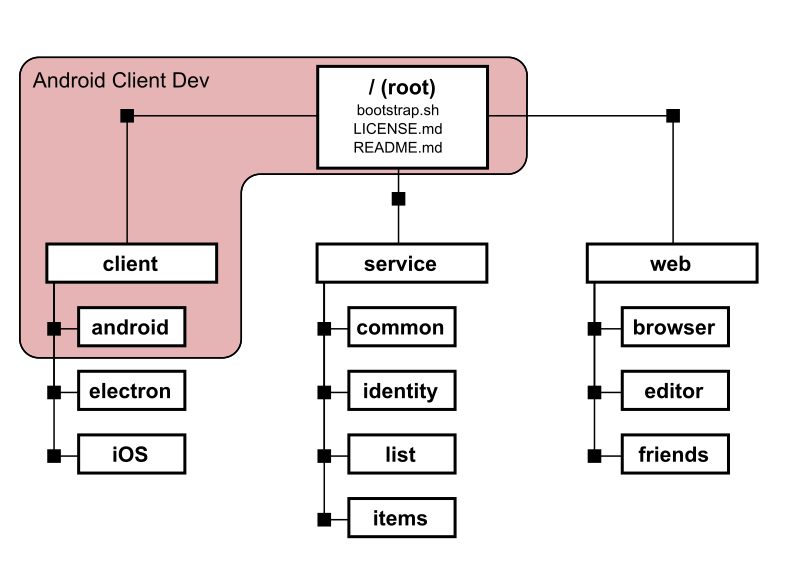
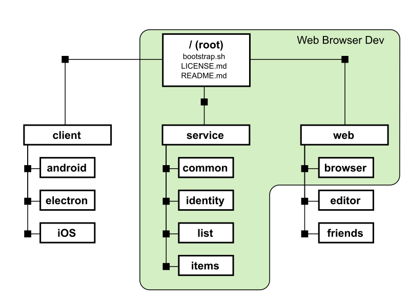
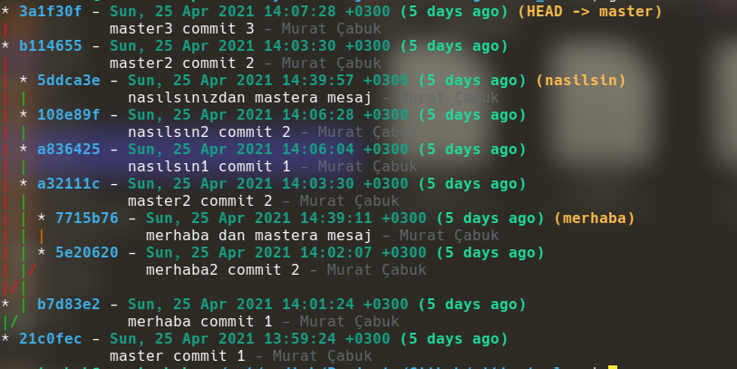
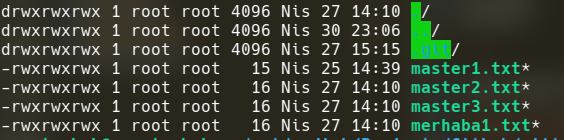
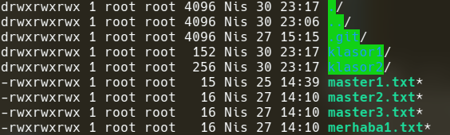

## sparse-checkout

**!! ancak unutulmamalı şuan için bu özellik tam release olmadı!! git version 2.25 ile beraber gelen bir özellik**

**!! henüz tek dosyayı ekleme veya çıkartma özelliği yok görünüyor.**


gitignore un tersi gibi düşünebiliriz.checkout u belli dosya ve klasörler için yapmak. gitignore da push yaparken belli dosyaları sunucuya gönderirken burada sparse-chekout ile 

- daha pull/clone yaparken belli dosyaları alpamyı sağlayabilir
- yada dosyaların tümünü bile almış olsak sparse-checkout ile working directory ye sadece space-checkot dosyasındaki patterne uyan klasörleri ve dosyaları woking directory ye alabiliriz. 


_git sparse-checkout_  komutu sparse-checkout u configure eder. Konfigürasyon için de subcommand ları kullanır. konfigurayon yapılmış olsa bile tekrar init yapıladığı sürece yada enable yapılmadığı sürece bu özellik çalışmayacaktır.

```
git sparse-checkout <subcommand> [options]
```

özelliği enable etmek için

```
config core.sparsecheckout true
# veya tekrar init edildiğinde de eski dosyalar varolduğu için enable ediyor, yeniden oluşturmuyor

config core.sparsecheckout init
```

dosya ve klasörler filtrelenirken gitignore dakine benzer bir yapı kullanır. bu patterne __cone pattern__ denir.


cone pattern i kullanabilmek için 2 yöntem var 

1. cone patterni enable ederek .git/info/sparse-checkout dosyasına doğrudan pattern kayıtları girilebilir
2. yada cone disable haldeyken sadece _git sparse-checkout set folder_path1_  komutu ile sparse-checkout dosyasına kayıt girdirebiliriz.

```
config core.sparsecheckout init --cone

git sparse-checkout set <dir1> <dir2> 
```

**subcommands**

- **init:** sistemde tanımlı sparse-checkout doslyalrındaki patternleri listeler
- **set:** yeni pattern veya didin eklemek için kullanılır. dikkat edilmesi gereken konu core.sparseCheckoutCone eğer enabled durumdaysa set işleminde yazılanlar klasör listesi olarak alınarrak patterne çevrilip sparse-checkout a yazılr. core.sparseCheckoutCone enable değilse ozaman soğrudan yazılanlar pattern olarak kabül edilir. set aynı zamanda yeni eklene kurala göre working directory yi update eder.
- **add:** yeni kural ekler (henüz çalışmıyr görünüyor ama dökümanlarda var)
- **reapply:** kuralları tekrar çalıştırır (henüz çalışmıyor görünüyor ama dökümanlarda var)
- **disable:** core.sparseCheckout disable eder

örnek uygulama



```
# init yaptığımızda root daki dosyalar eklenir
git sparse-checkout init --cone

# code u enable ettiğimiz için folder listesi veriyoruz.
# örneğimizde amacımız client altındaki androit için
git sparse-checkout set client/android

$ ls client/
android/

```

diğer örnek




```

git sparse-checkout init --cone
git sparse-checkout set service web/browser

$ ls
bootstrap.sh*  LICENSE.md  README.md  service/  web/

$ ls service/
common/  identity/  items/  list/

$ ls web
browser/

```

şimdi kendi örneğimizi yapalım. tree yapımızı inceleyelim.



dosy listesini bakalım



master branch i üzerindeyken 2 klasör ve klasörlerin içine de bir iki dosya ekliyoruz.



şimdi diyelimki amacımız root dakiş dosyaları vr klasor1 klasörünü sparse-checkout yapmak olsun. yani amacımız kalsor2 yi working directory den kaldırmak


```
git sparse-checkout init --cone
```
sadece bu komut bile default olarak tüm klasölerli kaldırır. bulundumuz klasörde dosya listesine bakacak olursak eorking dicektory den bütün klasörlerin kalktığını görebiliriz. 
```
ls

drwxrwxrwx 1 root root 4096 May  2 01:25 .git/
-rwxrwxrwx 1 root root   15 May  1 23:34 master1.txt*
-rwxrwxrwx 1 root root   16 May  1 23:34 master2.txt*
-rwxrwxrwx 1 root root   16 Nis 27 14:10 master3.txt*
-rwxrwxrwx 1 root root   16 May  1 23:17 merhaba1.txt*
```


sparse-checkout conf dosyasını kontrol edecek olursak görülceği üzere sistem en önce herşeye izin verip sonra kısıtlama yapmış. genelde de zaten cone patterni bu şekilde çalışıyor izin ver engelle şeklinde (https://git-scm.com/docs/git-sparse-checkout#_cone_pattern_set)
```
cat .git/info/sparse-checkout

/*
!/*/

```


```
git sparse-checkout set klasor1

cat .git/info/sparse-checkout 
/*
!/*/
/klasor1/


#daha sonra root path de iken git checkout dediğimizde. working directory nin aşağıdaki gibi olduğu görülür.

ls

drwxrwxrwx 1 root root 4096 May  1 00:53 .git/
drwxrwxrwx 1 root root    0 Nis 30 23:17 klasor1/
-rwxrwxrwx 1 root root   15 Nis 25 14:39 master1.txt*
-rwxrwxrwx 1 root root   16 Nis 27 14:10 master2.txt*
-rwxrwxrwx 1 root root   16 Nis 27 14:10 master3.txt*

# beklentimiz klasor2 nin de buradan da kalkmış olması
```

bu şekilde çalışdığında zaten pull işlemlerinde hiç birzaman çalışmadığımız doyalar sunucuya gitmemiş olacak. 

git clone yaparken de örneğin alttaki gibi bir komut kullanılırsa sparse-checkout otomatik olarak init olur.

```
git clone --sparse --filter=blob:none --depth=1 <source-repo-url>
# veya

git clone --depth 1 --filter=sparse:path=klasor1
```


- https://git-scm.com/docs/git-sparse-checkout
- https://github.blog/2020-01-13-highlights-from-git-2-25/
- https://briancoyner.github.io/articles/2013-06-05-git-sparse-checkout/
- https://github.blog/2020-01-17-bring-your-monorepo-down-to-size-with-sparse-checkout/

